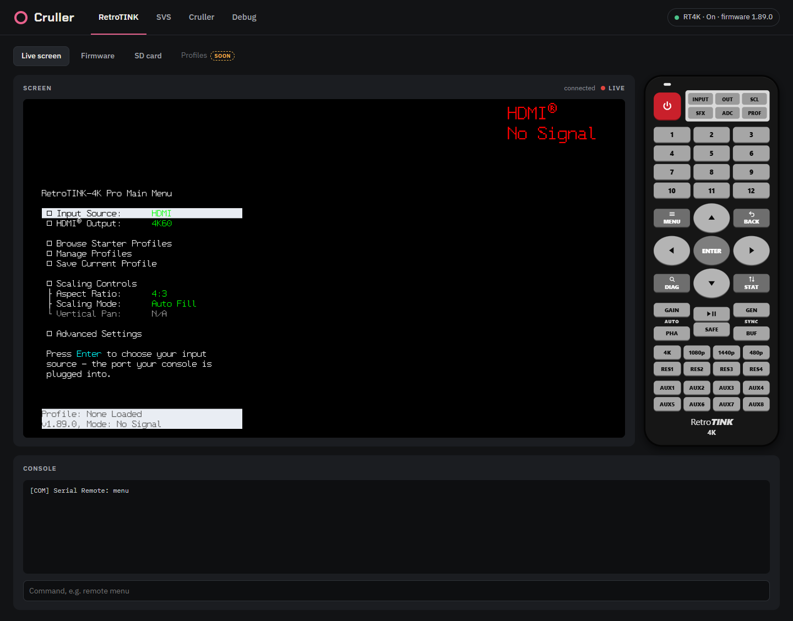
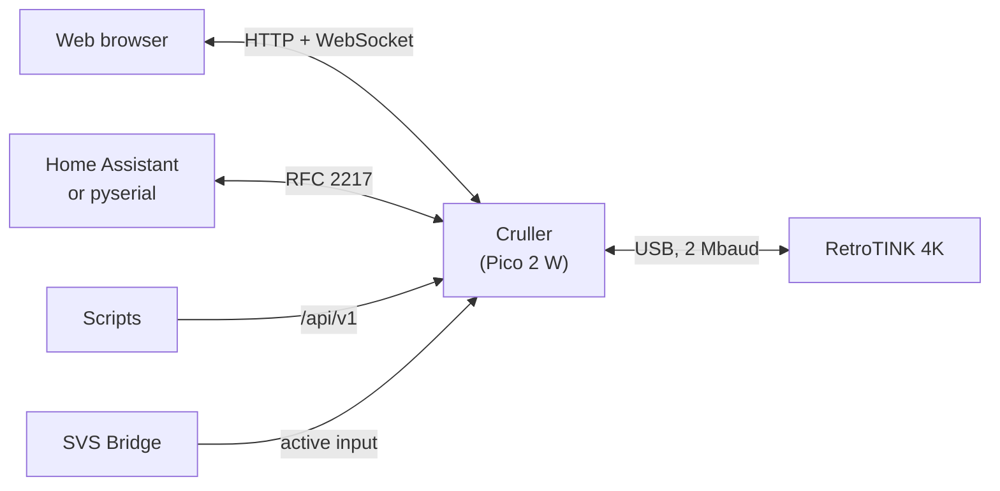
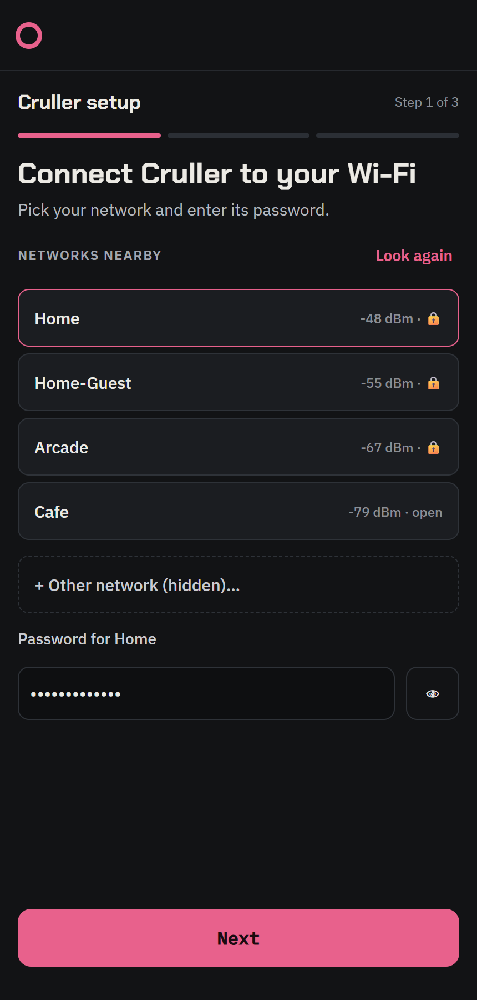
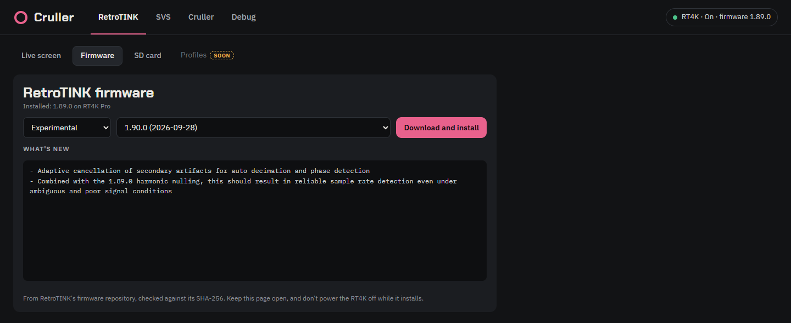
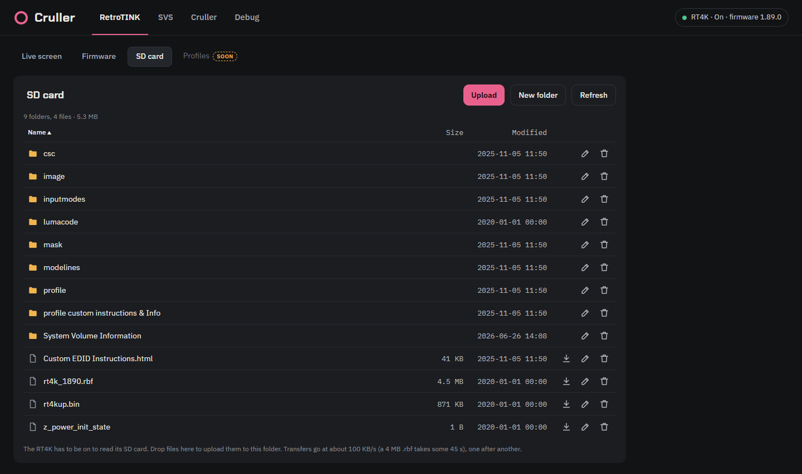
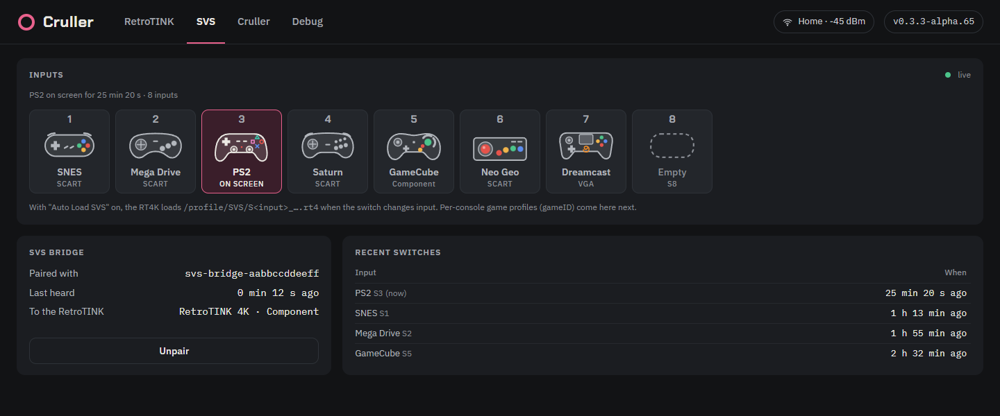
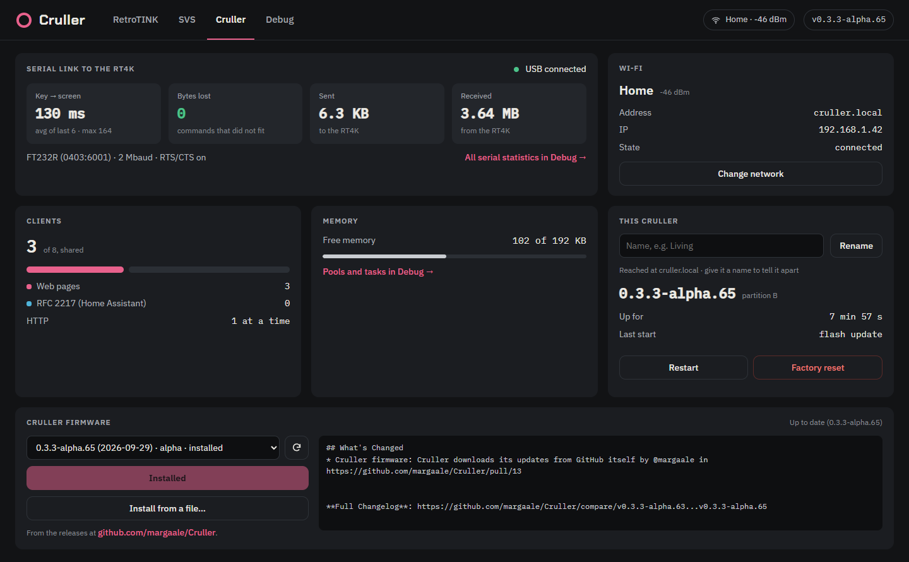

<div align="center">

# Cruller

**Put your [RetroTINK 4K](https://www.retrotink.com/) on your network.**<br>
See its menu live and drive it from any browser, update its firmware and manage its SD card
without pulling the card, and let Home Assistant and your SVS switch talk to it.

[](https://github.com/margaale/Cruller/actions/workflows/build.yml)
[](https://github.com/margaale/Cruller/releases)
[](https://github.com/raspberrypi/pico-sdk)
[](LICENSE)

</div>

Cruller is firmware for a Raspberry Pi Pico 2 W that plugs into the RetroTINK 4K's USB-C port,
where you would otherwise connect a PC. It talks to the RT4K over its USB serial port and serves a
web page over Wi-Fi, so the scaler can live behind the TV and still be managed from your phone.



> [!NOTE]
> Cruller is young: every release so far is an alpha. Automatic game profiles (gameID) are next.

## Features

- **Live screen**: the RT4K's on-screen menu and messages, mirrored in the page as they change,
  about a tenth of a second after a key press. Double-click for full screen.
- **The remote, in the browser**: every key of the RT4K's remote, laid out like the real one, plus
  the arrow keys, Enter and Escape on your keyboard.
- **RT4K firmware updates without the SD card**: pick a release or experimental version from
  [RetroTINK's firmware repository](https://github.com/RetroTINK-LLC/firmware). It's checked
  against its SHA-256, written to the RT4K's card and installed by the RT4K itself.
- **The SD card, over the network**: browse it, download, upload, make folders, rename and delete.
- **Power state**: on, starting or standby, followed without waking the RT4K.
- **Your SVS switch**: with an [SVS Bridge](https://github.com/margaale/svs-bridge), the input on
  screen and the console on each input.
- **Home Assistant and scripts**: a JSON API for commands, and the RT4K's serial port on the
  network (RFC 2217), where each client gets only the replies to its own commands.
- **Updates itself safely**: over the air from GitHub or from a file. The Pico 2 W keeps two
  copies, and a new version is kept only once it runs. Otherwise the board goes back to the one
  before.
- **Setup from your phone**: a setup network with a step-by-step wizard, and names
  (`cruller-living.local`) for when you have more than one.

## How it fits together



Everything on the left reaches Cruller over your Wi-Fi. The RT4K's USB-C port is an FTDI FT232R
serial adapter: Cruller is the USB host on the Pico's micro-USB port and talks to it at 2 Mbaud
with RTS/CTS flow control. Over that line go the RT4K's text console and, since RT4K firmware 1.75,
its binary transfers (the on-screen menu, files), which Cruller implements as described in
[docs/RTL1.md](docs/RTL1.md).

## What you need

- **A RetroTINK 4K** with firmware 1.75 or newer. Cruller is developed on an RT4K Pro.
- **A Raspberry Pi Pico 2 W** (RP2350 with Wi-Fi). Not the Pico W or the Pico 2 without W.
- **A micro-USB OTG adapter that also supplies power**, since the Pico is the USB host, and a
  USB-A to USB-C cable from the adapter to the RT4K.
- A 2.4 GHz Wi-Fi network (the Pico 2 W has no 5 GHz radio).
- Optional: an [SVS](https://scalablevideoswitch.com/) with an
  [SVS Bridge](https://github.com/margaale/svs-bridge), and
  [Home Assistant](https://www.home-assistant.io/).

The releases also carry an ESP32-S3 build (ESP32-S3-DevKitC-1 N16R8), but that port has no RT4K
link yet.

## Installation

### 1. Install Cruller on the Pico

You only do this once over a cable. Later updates happen over the air.

1. Download `cruller-<version>-pico2_w-cruller-factory.uf2` from the newest
   [release](https://github.com/margaale/Cruller/releases).
2. Hold the Pico's **BOOTSEL** button while you plug it into your computer. It shows up as a drive
   called `RP2350`.
3. Copy the file to that drive. The Pico restarts into Cruller by itself.

The factory image holds the partition table and Cruller together. The other file in each release,
`cruller.uf2`, is the update that the Cruller tab installs over the air.

### 2. Put it on your Wi-Fi



1. With no network saved, Cruller creates the open network `Cruller_Setup` (the Pico's LED blinks
   once a second). Power it from any USB port for this, or set it up already behind the RT4K.
2. Join that network from a phone or laptop. The setup page opens by itself (otherwise, browse to
   `http://192.168.4.1`).
3. Pick your network and enter its password.
4. Give it a name if you like: "Living" makes it `cruller-living.local`, and "Cruller Living" in
   Home Assistant. You can change it later.
5. Cruller tries the password while the setup network stays up, and tells you if it's wrong. Once
   it has joined, it shows its address, closes the setup network after 20 s and restarts on yours.
6. From your home network, open **`http://cruller.local`** (or the name you gave it).

<br clear="right">

| Pico LED | Meaning |
|---|---|
| Fast blink (5 a second) | Joining your Wi-Fi |
| Slow blink (once a second) | The setup network is up |
| On | Connected |

### 3. Connect the RT4K

Plug the OTG adapter into the Pico's micro-USB port, connect it to the RT4K's USB-C port, and power
it. The chip in the top right of the page shows the RT4K's power state and firmware version, green
while it's on.

## Using it

### The RetroTINK tab

- **Live screen**: the RT4K's menu as it looks on your TV (see the screenshot at the top of this
  page). It stops polling while the RT4K is in standby.
- **Remote**: every key of the RT4K's remote. The power key asks before turning the RT4K off. While
  this tab is open, your keyboard's arrows, Enter, Escape (back) and Tab (menu) work too.
- **Console**: type any RT4K serial command, such as `remote menu` or `ver`. You see the replies to
  your own commands.

#### Firmware



Pick **Release** or **Experimental**, then a version, and press **Download and install**. Your
browser downloads the zip from RetroTINK's firmware repository, checks it against the SHA-256 the
repository lists, and unzips it. Cruller writes the files to the RT4K's SD card (only your model's
`.rbf`, and `rt4kup.bin` last), and the RT4K checks them. Once you confirm, the RT4K installs the
update and restarts, which takes about 40 s. Keep the page open, and don't turn the RT4K off while
it installs.

#### SD card



Browse the RT4K's SD card, download files, upload them (with the button, or by dropping them on the
list), make folders, rename, and delete files or whole folders. Transfers go at about 100 KB/s, so a
4 MB `.rbf` takes some 45 s, one after another. The RT4K has to be on. It has no clock, so files
written over the network are dated 2020-01-01.

### The SVS tab



The RT4K can't tell when an [SVS](https://scalablevideoswitch.com/) switch changes input, so the
[SVS Bridge](https://github.com/margaale/svs-bridge) tells Cruller. There's nothing to set up on
this side: the bridge finds Cruller on the network, you pick it in the bridge's Cruller tab, and
Cruller pairs with the first bridge that reports to it.

The tab shows each input with the console on it (as picked in the bridge's SVS tab), the one on
screen lit, the output that goes to the RetroTINK, and the recent switches. **Unpair** frees Cruller
for another bridge. With "Auto Load SVS" on, the RT4K itself loads
`/profile/SVS/S<input>_….rt4` when the input changes. Per-console game profiles come next.

### The Cruller tab



- **Serial link to the RT4K**: key-to-screen time, bytes lost, traffic, and the adapter's settings.
- **Wi-Fi**: the network, its signal, and a way to change it.
- **Clients**: the web pages and RFC 2217 clients connected, out of 8 shared slots.
- **This Cruller**: rename it (it restarts under its new `.local` name), its version and slot,
  **Restart** and **Factory reset**.
- **Cruller firmware**: pick a release and press **Download and install**. Cruller downloads the
  image from GitHub itself, checks its size and SHA-256 against GitHub's, writes it to the slot it
  isn't running from, and restarts into it. If the new version doesn't come up healthy, the board
  goes back to the previous one. **Install from a file…** takes a `cruller.uf2`. A board running a
  release only sees releases; one running an alpha also sees alphas.

The **Debug** tab has live charts and counters (serial link, command queue, memory, the screen
mirror, tasks), and the logs.

### Home Assistant and scripts

**RFC 2217.** The RT4K's serial port is also on the network, at `rfc2217://cruller.local:2217`,
for pyserial and anything built on it. Several clients can share it with the page, and each one
sees only the replies to its own commands. [hass-RT4K](https://github.com/sjftech/hass-RT4K)
drives an RT4K through it once it takes network serial ports
([sjftech/hass-RT4K#1](https://github.com/sjftech/hass-RT4K/pull/1)).

**HTTP API.** `POST /api/v1/command` sends commands to the RT4K and returns their replies. The body
can be `{"command": "…"}`, `{"commands": ["…", "…"]}` (up to 8), `{"button": "menu"}` with
hass-RT4K's button names (`power_on`, `power_off`, `menu`, `up`…), or plain text, one command per
line:

```bash
curl -X POST http://cruller.local/api/v1/command -d '{"command": "ver"}'
```

```json
{
  "ok": true, "power": "on",
  "results": [
    {"command": "ver", "sent": true,
     "reply": ["[COM] RT4KPRO, FW Version: 1.89.0", "[COM] Build tag: b0928e"]}
  ]
}
```

If a command couldn't be sent (the RT4K isn't connected), `ok` is `false` and the answer is a
`503`. `GET /api/v1/state` returns the RT4K's power state, the switch's active input and Cruller's
own, and `GET /api/v1/info` who this Cruller is. The API is versioned: a script written for
`/api/v1` keeps working as Cruller changes. All of it is in [docs/API.md](docs/API.md).

**Discovery.** Cruller announces itself over mDNS as `_rt4k._tcp` (TXT `id`, `ver`, `api`: the API's
version, and `name` once named), `_rfc2217._tcp` and `_http._tcp`.

## Security

Cruller has no passwords: anyone on your network can open its page, use its API and its RFC 2217
port, and update it. Everything is plain HTTP. Keep it on a network you trust, and don't forward its
ports to the internet.

## Factory reset

In the page, go to **Cruller** → **Factory reset**. Cruller forgets its Wi-Fi network, its name and
its SVS Bridge, and restarts into the setup network. The installed firmware stays.

If you can't reach the page at all, erase the Pico (hold BOOTSEL while plugging it in, then
`picotool erase`, or Raspberry Pi's `flash_nuke.uf2` from
[Resetting flash memory](https://www.raspberrypi.com/documentation/microcontrollers/pico-series.html#resetting-flash-memory))
and install it again.

## Troubleshooting

- **`cruller.local` doesn't open.** Some devices and networks don't resolve `.local` names. Use
  Cruller's IP address from your router instead.
- **The page says "RT4K not connected".** Check that the OTG adapter supplies power, and that the
  cable carries data: a charge-only cable looks exactly like no device.
- **The RT4K shows as "Standby".** It's asleep: the power key on the page's remote wakes it. The SD
  card and firmware updates need it on.
- **`Cruller_Setup` appeared again.** Cruller couldn't join your network when it started (the router
  was off, say) and waits in setup mode. Restart it once the network is back, or set it up again.
- **An update from GitHub failed.** The page says why and offers the image to download, so you can
  install it with **Install from a file…**.

## Building from source

The Pico 2 W build needs the [Pico SDK](https://github.com/raspberrypi/pico-sdk) 2.3,
[FreeRTOS-Kernel](https://github.com/raspberrypi/FreeRTOS-Kernel) (Raspberry Pi's fork),
[TinyUSB](https://github.com/hathach/tinyusb) 0.21.0, the Arm GNU toolchain 14.2,
[picotool](https://github.com/raspberrypi/picotool) 2.3, CMake, Ninja and Python 3. The exact
versions CI uses are at the top of [build.yml](.github/workflows/build.yml).

```bash
scripts/build.sh rp2
```

The script defaults to the author's paths. Set `PICO_SDK_PATH`, `FREERTOS_KERNEL_PATH`,
`PICO_TINYUSB_PATH`, `PICO_TOOLCHAIN_PATH`, `PICOTOOL_DIR` and `PIOASM_DIR` for yours. It applies
Cruller's patches to that TinyUSB checkout (`src/platform/rp2/patches/tinyusb`), and discards local
edits there when the patches change.

The build goes to `build/rp2`: `cruller.uf2` is the OTA image and `cruller-factory.uf2` installs a
new board. To install a build on a board on your network:

```bash
curl --data-binary @build/rp2/cruller.uf2 http://cruller.local/update
```

The Pico's boot ROM starts the newer of its two copies, and a local build is build 0, older than
any CI build of the same version. Pass `CRULLER_VERSION` and `CRULLER_BUILD` to go above the one
installed. A local build takes its version from `src/version.cmake`, and CI passes its own.

`scripts/build.sh esp32`, in an ESP-IDF 6.1 shell, builds the ESP32-S3 port into `build/esp32`.

## Development

### Tests

The pure parts of `src/core` (the RTL1 engine, WebSocket framing, power state, the RFC 2217
parser, the console's reply windows, the SVS Bridge's reports, the GitHub download's URLs) and the
page's JavaScript (the firmware updater, the SD card view) are tested on the host, with no Pico:

```bash
tests/run.sh
```

It needs gcc, and Node.js for the page's tests.

### Source layout

```
src/core/            The common code (HTTP, WebSocket, console, RTL1, RFC 2217, power, SVS,
                     settings, firmware downloads), and the interfaces each board implements
src/platform/rp2/    The Raspberry Pi Pico 2 W: startup, Wi-Fi and the setup portal, the RT4K's
                     USB host, flash (A/B slots, settings), watchdog
src/platform/esp32/  The ESP32-S3 port, an ESP-IDF project (no RT4K link yet)
src/web/             The page, embedded as C arrays at build time
tests/               Host tests of src/core and the page
scripts/             build.sh, and tls_roots.sh for the Pico's HTTPS roots
docs/                DESIGN.md, RTL1.md (the RT4K's binary protocol), SVS.md (the SVS Bridge)
```

The layout matches the [SVS Bridge](https://github.com/margaale/svs-bridge).

### Branches and releases

Work goes to `develop` (the default branch) through pull requests, and `master` takes what is
released. Versions come from GitVersion (`GitVersion.yml`) and
[CI](.github/workflows/build.yml):

- **`master`**: every push is a release, `vX.Y.Z`. The patch number grows with each one; a line
  `+semver: minor` in a commit message bumps the minor.
- **`develop`**: every push is a pre-release, `vX.Y.Z-alpha.N`. N is CI's run number, which grows
  with every build on every branch, so a newer build always has a newer version.
- **Pull requests**: built as `X.Y.Z-pr.N`, not published. The images are attached to the run.

Release images are named `cruller-<version>-<board>-<file>`. Each board has two:
`cruller-factory.uf2` (Pico 2 W) or `cruller-factory.bin` (ESP32-S3, at `0x0`) installs a new
board, and `cruller.uf2` or `cruller.bin` is the OTA image.

## Technical notes

<details>
<summary><b>The RT4K link</b></summary>

The RT4K's FT232R holds only about 1.3 ms of data at 2 Mbaud, so the receive path (TinyUSB, the
serial driver, the RTL1 decoder, the FreeRTOS kernel) runs from RAM: from flash, it went cold in
the cache while Wi-Fi code ran on the other core, and the FT232R overflowed. Cruller uses TinyUSB
0.21 (the SDK's 0.18 polls bulk transfers once per frame, too slow for 2 Mbaud) with two patches
for the FTDI status bytes. RTS/CTS flow control stays on, so uploads stream at the RT4K's own pace
and commands wait instead of being lost while it's busy.

</details>

<details>
<summary><b>One console, several clients</b></summary>

The page, the API, RFC 2217 clients and Cruller's own checks share the RT4K's console, and its
replies don't say who they're for. Cruller sends one command at a time and opens a reply window:
lines that come back meanwhile belong to that command. The window closes on the reply's known last
line, or after 50 ms of quiet. The RT4K answers in 1 to 17 ms. See
[docs/DESIGN.md](docs/DESIGN.md#rt4k-console).

</details>

<details>
<summary><b>Updates: two slots, try before you buy</b></summary>

The Pico 2 W's flash has a partition table with two 1856 KB slots and a data partition for the
settings. The RP2350's boot ROM starts the slot with the higher version. An update goes to the
other slot, and the boot ROM starts it on trial: Cruller confirms it once it's up, and if it never
gets there, the watchdog sends the board back to the previous slot. That's also why every build
needs a higher version than the last: the version's minor number carries CI's run number. See
[docs/DESIGN.md](docs/DESIGN.md#ota-cruller-to-cruller).

</details>

<details>
<summary><b>SVS Bridge reports</b></summary>

The bridge reports the active input and the switch's layout with `POST /api/v1/svs` on every change
and every 60 s. `GET /api/v1/svs` returns what Cruller last heard. The format, discovery and pairing
are in [docs/SVS.md](docs/SVS.md).

</details>

## Related projects

- [SVS Bridge](https://github.com/margaale/svs-bridge): puts an SVS switch on the network and tells
  Cruller which input is on screen.
- [hass-RT4K](https://github.com/sjftech/hass-RT4K): the RetroTINK 4K in Home Assistant.
- [RetroTINK firmware](https://github.com/RetroTINK-LLC/firmware): the RT4K's official firmware,
  which the updater installs from.

## Acknowledgements

- [RetroTINK](https://www.retrotink.com/), for the RetroTINK 4K and its serial interface.
- Built on the [Pico SDK](https://github.com/raspberrypi/pico-sdk),
  [FreeRTOS](https://www.freertos.org/), [lwIP](https://savannah.nongnu.org/projects/lwip/),
  [TinyUSB](https://github.com/hathach/tinyusb), [Mbed TLS](https://github.com/Mbed-TLS/mbedtls)
  and [littlefs](https://github.com/littlefs-project/littlefs).

## Disclaimer

Cruller is an independent project, not affiliated with or endorsed by RetroTINK, Raspberry Pi or
the makers of the SVS. Flashing firmware, to the Pico or to the RT4K, is at your own risk. The
software comes with no warranty (see the license).

## License

[GNU General Public License v3.0](LICENSE)
